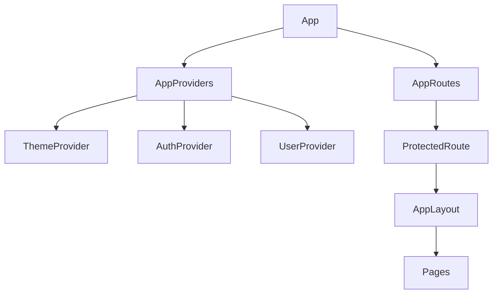

# Role-Based User Management Dashboard

A modern, feature-rich React application for managing users with role-based access control. Built with TypeScript, Material-UI, and Vite for optimal performance and developer experience.


## 🎯 Features

### Authentication & Authorization
- ✅ **Mock Authentication System** with 3 role levels (Admin, Manager, Viewer)
- ✅ **Role-Based Access Control (RBAC)** with granular permissions
- ✅ **Protected Routes** with automatic redirection
- ✅ **Session Persistence** using localStorage
- ✅ **Password Visibility Toggle** for better UX

### User Management
- ✅ **Full CRUD Operations** (Create, Read, Update, Delete)
- ✅ **User Status Management** (Active/Inactive)
- ✅ **Duplicate Prevention** (Email & Phone validation)
- ✅ **Advanced Filtering** by role, city, and search
- ✅ **Sorting Capabilities** (Name, Company)
- ✅ **Pagination** with customizable rows per page
- ✅ **Responsive Views** (Table on desktop, Cards on mobile)

### User Interface
- ✅ **Modern Dark/Light Theme** with system preference detection
- ✅ **Collapsible Sidebar** for better space utilization
- ✅ **Auto-Hide Scrollbars** for cleaner appearance
- ✅ **Glassmorphism Effects** on login page
- ✅ **Gradient Backgrounds** matching theme colors
- ✅ **Smooth Animations** throughout the app
- ✅ **Responsive Design** (Mobile, Tablet, Desktop)

### Pages & Navigation
- ✅ **Dashboard** - Statistics, quick actions, permissions panel
- ✅ **Users** - Complete user management with CRUD
- ✅ **Profile** - Personal account management
- ✅ **Settings** - Theme, notifications, preferences
- ✅ **Reports** - Analytics and role distribution

### Technical Features
- ✅ **TypeScript** for type safety
- ✅ **React Context API** for state management
- ✅ **React Router** for client-side routing
- ✅ **Axios** for API integration
- ✅ **Debounced Search** for performance
- ✅ **Error Boundaries** for graceful error handling
- ✅ **Custom Hooks** for reusable logic

---

## 🚀 Quick Start

### Prerequisites

- **Node.js** 16.x or higher
- **npm** or **yarn** package manager

### Installation

1. **Clone the repository**
   ```bash
   git clone https://github.com/your-username/role-based-user-dashboard.git
   cd role-based-user-dashboard
   ```

2. **Install dependencies**
   ```bash
   npm install
   ```

3. **Start the development server**
   ```bash
   npm run dev
   ```

4. **Open your browser**
   ```
   http://localhost:3000
   ```

### Build for Production

```bash
# Create production build
npm run build

# Preview production build locally
npm run preview
```

### Deployment to Vercel

1. **Install Vercel CLI**
   ```bash
   npm install -g vercel
   ```

2. **Deploy**
   ```bash
   vercel
   ```

The `vercel.json` file is already configured to handle client-side routing.

---

## 🔑 Login Credentials

| Email | Password | Role | Permissions |
|-------|----------|------|-------------|
| `admin@example.com` | `admin123` | Admin | View, Add, Edit, Delete |
| `manager@example.com` | `manager123` | Manager | View, Add, Edit |
| `viewer@example.com` | `viewer123` | Viewer | View Only |

---

## 🏗️ Architecture Overview

### Project Structure

```
src/
├── app/
│   ├── providers/          # Context providers (Auth, User, Theme)
│   └── theme/              # MUI theme configuration
├── components/
│   ├── common/             # Reusable components (Error, Loading, etc.)
│   ├── layout/             # Layout components (AppLayout, TopBar, SideNav)
│   └── users/              # User-specific components (Table, Modal, Drawer)
├── hooks/                  # Custom React hooks
├── pages/                  # Page components (Dashboard, Users, Profile, etc.)
├── routes/                 # Route configuration and protection
├── services/               # API services and integrations
├── types/                  # TypeScript type definitions
└── utils/                  # Utility functions (validators, permissions, storage)
```

### Technology Stack

| Layer | Technology | Purpose |
|-------|-----------|---------|
| **Frontend Framework** | React 18.2.0 | UI rendering and component composition |
| **Language** | TypeScript 5.0.2 | Type safety and developer experience |
| **UI Library** | Material-UI 5.14.0 | Pre-built components and design system |
| **Build Tool** | Vite 4.4.5 | Fast development and optimized builds |
| **Routing** | React Router 6.14.2 | Client-side navigation |
| **HTTP Client** | Axios 1.4.0 | API communication |
| **State Management** | React Context API | Global state (Auth, Users, Theme) |

### Component Architecture



### Data Flow

1. **User Authentication** → AuthProvider stores auth state in Context + localStorage
2. **User Data** → UserProvider fetches from API, stores in Context, provides CRUD operations
3. **Theme** → ThemeProvider manages dark/light mode, persists to localStorage
4. **Navigation** → React Router handles routes, ProtectedRoute guards secure pages
5. **API Integration** → Axios fetches from JSONPlaceholder, enhances with local data

### State Management Strategy

- **Auth State**: Username, role, authentication status
- **User State**: User list, filters, sort config, loading/error states
- **Theme State**: Current mode (light/dark)
- **Local State**: Component-specific state (forms, modals, drawers)

---

## 📊 Data Source & API Integration

### JSONPlaceholder API

- **Endpoint**: https://jsonplaceholder.typicode.com/users
- **Purpose**: Provides 10 sample users with realistic data
- **Enhancement**: Local enrichment with roles and timestamps

### Data Schema

```typescript
interface User {
  id: number;
  name: string;
  email: string;
  role: 'Admin' | 'Manager' | 'Viewer';
  company: string;
  city: string;
  website: string;
  phone: string;
  active: boolean;
  createdAt: string;
  updatedAt: string;
}
```

---

## 🔐 Security & Permissions

### Permission Matrix

| Action | Admin | Manager | Viewer |
|--------|-------|---------|--------|
| View Users | ✅ | ✅ | ✅ |
| Add User | ✅ | ✅ | ❌ |
| Edit User | ✅ | ✅ | ❌ |
| Delete User | ✅ | ❌ | ❌ |
| View Profile | ✅ | ✅ | ✅ |
| Edit Profile | ✅ | ✅ | ✅ |

### Implementation

- **Route Protection**: ProtectedRoute component wraps all authenticated pages
- **Component-Level**: Conditional rendering based on `canViewUsers()`, `canAddUser()`, etc.
- **UI Feedback**: Disabled buttons, hidden actions, info messages for restricted users

---

## 🎨 Design System

### Color Palette

| Color | Light Mode | Dark Mode | Usage |
|-------|-----------|-----------|-------|
| Primary | #4F46E5 (Indigo) | #6366F1 | Buttons, links, highlights |
| Secondary | #06B6D4 (Cyan) | #22D3EE | Accents, secondary actions |
| Success | #16A34A | #22C55E | Active status, success states |
| Error | #DC2626 | #EF4444 | Inactive status, errors |
| Warning | #EA580C | #F97316 | Warnings, alerts |

### Typography

- **Font Family**: Inter (Google Fonts)
- **Headings**: 700-800 weight
- **Body**: 400-500 weight
- **Code**: Monospace

### Spacing & Layout

- **Grid System**: 12-column responsive grid
- **Breakpoints**: xs (0px), sm (600px), md (960px), lg (1280px), xl (1920px)
- **Padding**: 8px base unit (multiples of 8)

---

## 🛠️ Assumptions & Trade-offs

### Assumptions

1. **Mock Authentication**
   - Assumption: Production will integrate with real authentication service (OAuth, JWT)
   - Current: Simple email/password with predefined credentials
   - Trade-off: Simpler implementation vs. production-ready security

2. **In-Memory Data Persistence**
   - Assumption: Real backend will handle data persistence
   - Current: User modifications persist only during session
   - Trade-off: No backend complexity vs. data persistence across sessions

3. **Client-Side Permissions**
   - Assumption: Backend will enforce permissions server-side
   - Current: Role checks happen in frontend only
   - Trade-off: Better UX vs. security (frontend can be bypassed)

4. **Fixed User Roles**
   - Assumption: Role structure is stable (Admin, Manager, Viewer)
   - Current: No dynamic role creation
   - Trade-off: Simpler permission logic vs. flexibility

### Trade-offs

#### 1. **Context API vs. Redux**
- **Choice**: React Context API
- **Pros**: Simpler setup, no external dependency, sufficient for app size
- **Cons**: Less tooling, potential performance issues with large state trees
- **Rationale**: App complexity doesn't justify Redux overhead

#### 2. **JSONPlaceholder vs. Custom Backend**
- **Choice**: JSONPlaceholder API
- **Pros**: No backend setup, realistic data, publicly accessible
- **Cons**: Read-only, no actual persistence, limited to 10 users
- **Rationale**: Focus on frontend implementation, easy to swap later

#### 3. **Material-UI vs. Custom Components**
- **Choice**: Material-UI
- **Pros**: Comprehensive component library, accessibility built-in, theme system
- **Cons**: Larger bundle size, learning curve, design constraints
- **Rationale**: Faster development, professional look, accessibility compliance

#### 4. **localStorage vs. sessionStorage**
- **Choice**: localStorage for auth and theme
- **Pros**: Persists across browser sessions, better UX
- **Cons**: Security concerns (XSS attacks), not suitable for sensitive data
- **Rationale**: Acceptable for demo, needs secure HTTP-only cookies in production

#### 5. **Type Safety**
- **Choice**: TypeScript with strict mode
- **Pros**: Compile-time error detection, better IDE support, self-documenting
- **Cons**: Initial learning curve, more verbose code
- **Rationale**: Long-term maintainability outweighs initial overhead

#### 6. **Vite vs. Create React App**
- **Choice**: Vite
- **Pros**: Faster dev server (HMR), smaller bundle, modern tooling
- **Cons**: Newer ecosystem, fewer resources
- **Rationale**: Superior performance and development experience

---

## 🧪 Testing

### Running Tests

```bash
# Run tests (when implemented)
npm test

# Run tests with coverage
npm run test:coverage

# Run linter
npm run lint
```

### Test Strategy

- **Unit Tests**: Components and utility functions (Jest + React Testing Library)
- **Integration Tests**: User flows and permissions (Cypress)
- **E2E Tests**: Full authentication and CRUD workflows (Playwright)

---

## 📈 Performance Optimizations

1. **Code Splitting**: Lazy loading of routes
2. **Debounced Search**: 400ms delay to reduce API calls
3. **Memoization**: useMemo/useCallback for expensive computations
4. **Virtual Scrolling**: For large user lists (can be added)
5. **Image Optimization**: Lazy loading for avatars
6. **Bundle Optimization**: Vite's automatic code splitting

---

## 🔄 Future Enhancements

### Short-term (MVP+)
- [ ] Real backend integration (Node.js/Express + MongoDB)
- [ ] JWT authentication with refresh tokens
- [ ] Email verification and password reset
- [ ] User avatar upload
- [ ] Export users to CSV/PDF
- [ ] Advanced analytics dashboard

### Long-term (Scale)
- [ ] Multi-tenant support
- [ ] Audit logs and activity tracking
- [ ] Real-time notifications (Socket.io)
- [ ] Advanced permission editor
- [ ] API rate limiting
- [ ] Comprehensive test coverage (>80%)
- [ ] Internationalization (i18n)
- [ ] Accessibility audit (WCAG 2.1 AA)

---

## 🐛 Known Issues & Limitations

1. **Mock Authentication**: No real user verification or password encryption
2. **No Backend**: All changes are in-memory, lost on refresh
3. **Limited Users**: Fixed to 10 users from JSONPlaceholder
4. **No Email Service**: Profile changes don't send notifications
5. **Client-Side Permissions**: Can be bypassed with dev tools
6. **No File Upload**: Profile avatars use initials only

---

## 📝 License

This project is licensed under the MIT License - see the [LICENSE](LICENSE) file for details.

---

## 👥 Contributing

Contributions are welcome! Please follow these steps:

1. Fork the repository
2. Create a feature branch (`git checkout -b feature/AmazingFeature`)
3. Commit your changes (`git commit -m 'Add some AmazingFeature'`)
4. Push to the branch (`git push origin feature/AmazingFeature`)
5. Open a Pull Request

---

## 📞 Support

For issues, questions, or suggestions:
- **GitHub Issues**: [Create an issue](https://github.com/your-username/role-based-user-dashboard/issues)
- **Email**: your-email@example.com

---

## 🙏 Acknowledgments

- **JSONPlaceholder** - Free fake API for testing
- **Material-UI** - React component library
- **Vite** - Next generation frontend tooling
- **React** - JavaScript library for building user interfaces

---

**Built with ❤️ using React, TypeScript, and Material-UI**
"# dasboard" 
"# dasboard" 
